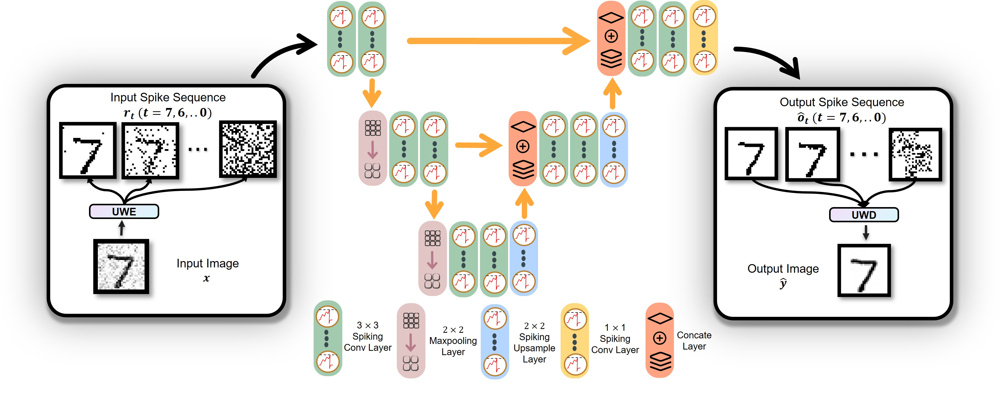
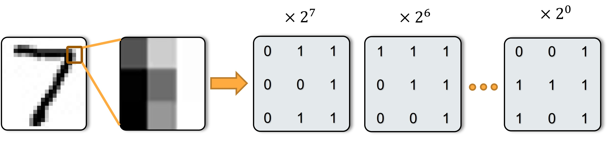
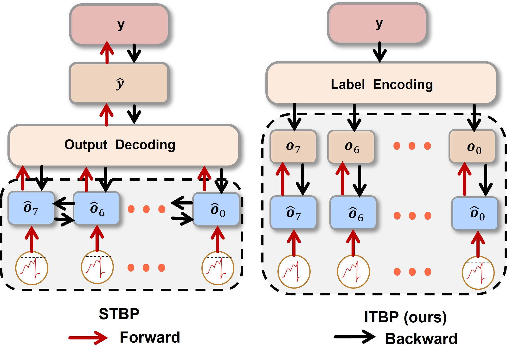

#  VTSNN: A Virtual Temporal Spiking Neural Network (first image reconstruction in SNN)
##  Image reconstruction workflow in SNN

## Encoding example 

## Backpropagation comparison

## Reconstruction results of VTSNN under different noises

official implementation of  VTSNN: A Virtual Temporal Spiking Neural Network

Accepted to Frontiers in Neuroscience (IF = 5.152)

paper: https://www.frontiersin.org/articles/10.3389/fnins.2023.1091097
# Get started
~~~
git clone https://github.com/bollossom/VTSNN.git
cd VTSNN
pip install spikingjelly
~~~

# Dataset and weight
Our coding MNIST dataset can be found in 
~~~
link：https://pan.baidu.com/s/11DaQt1Pb9E-V60bA_vHD6Q 
code：sm15
~~~

Our  MNIST weight dataset can be found in 
~~~
link：https://pan.baidu.com/s/1PpuRKxmJ4mJnvmBHbSDL3w 
code：c50
~~~
